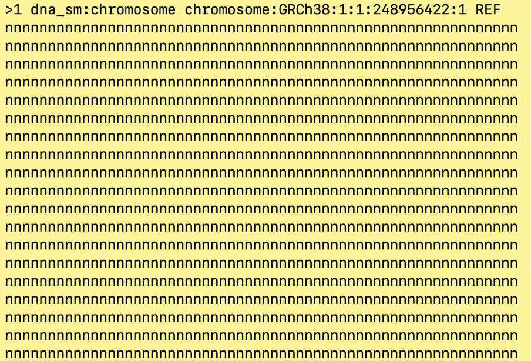
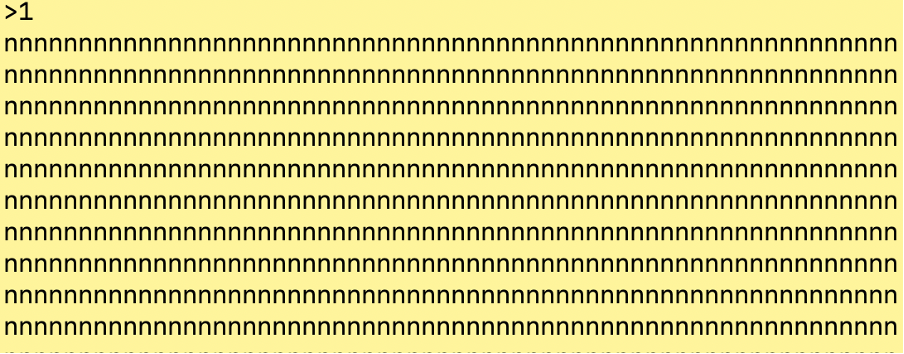
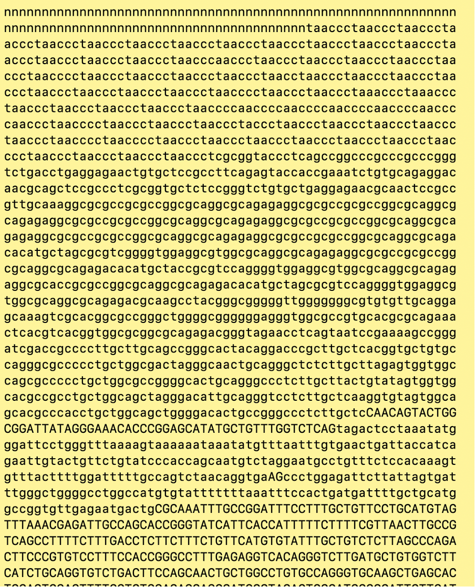
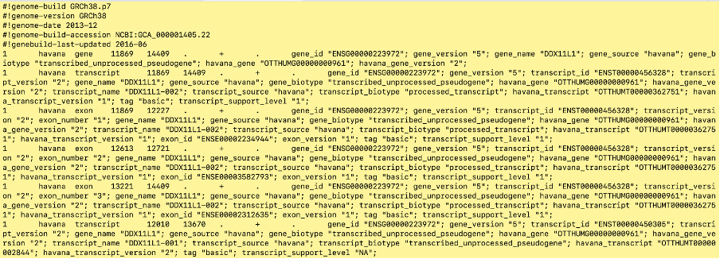

# Supplementary Information


## File Formats

Where can you source reference genomes and annotation files:
* Ensembl database: https://asia.ensembl.org/info/data/ftp/index.html
* USCS database: https://hgdownload.soe.ucsc.edu/downloads.html
* NCBI database: https://www.ncbi.nlm.nih.gov/guide/howto/dwn-genome/

The top of an ensembl homo sapiens fasta file:

```{r, echo=FALSE, out.width="100%",}

```

Fasta files will have a chromosome header line, indicated by the line starting with `>`. The header line will have the chromosome number and may contain some extra information. A minimal header can just have the chromosome number.

```{r, echo=FALSE, out.width="100%",}

```

The lines following the header will contain that specific chromosome’s sequence

```{r, echo=FALSE, out.width="100%",}

```

Annotation files are usually GTF or GFF3 format files. Below is a GTF file:

```{r, echo=FALSE, out.width="100%",}

```

A gtf file is a 'tab separated file'  - this means that it is a file with columns indicated by tab spacing. A GTF file will always have 9 columns containing the following information (taken from here): 

1. seqname - name of the chromosome or scaffold; chromosome names can be given with or without the 'chr' prefix. Note: the chromosome name format should be the same as the fasta file e.g if the fasta file has `chr1` then the gtf file should also have `chr1` in this column. If the fasta file has `1` then the gtf file should have `1` in this column. 
2. source - name of the program that generated this feature, or the data source (database or project name)
3. feature - feature type name, e.g. Gene, Variation, Similarity
4. start - Start position* of the feature, with sequence numbering starting at 1.
5. end - End position* of the feature, with sequence numbering starting at 1.
6. score - A floating point value.
7. strand - defined as + (forward) or - (reverse).
8. frame - One of '0', '1' or '2'. '0' indicates that the first base of the feature is the first base of a codon, '1' that the second base is the first base of a codon, and so on..
9. attribute - A semicolon-separated list of tag-value pairs, providing additional information about each feature.
